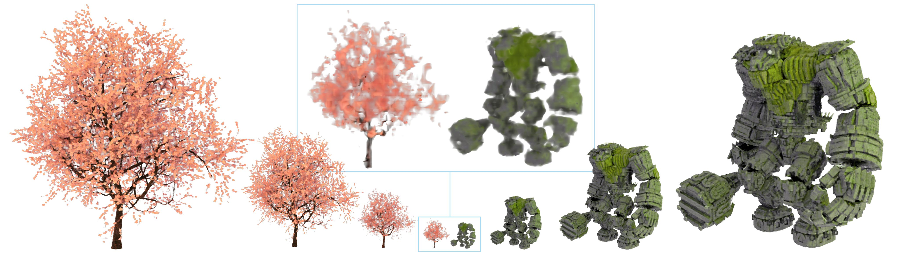

## Variable Bitrate Neural Fields

**Code is now available:** https://github.com/NVIDIAGameWorks/kaolin-wisp

We will eventually populate this repository with scripts and additional code for the various small experiments. Stay tuned!

This is the official code repository for [Variable Bitrate Neural Fields (SIGGRAPH 2022)](https://nv-tlabs.github.io/vqad) which compresses feature grids for neural fields using our VQ-AD (vector-quantized auto-decoder) method.

This work is authored by: 

[Towaki Takikawa](https://tovacinni.github.io), 
[Alex Evans](https://research.nvidia.com/person/alex-evans), 
[Jonathan Tremblay](https://research.nvidia.com/person/jonathan-tremblay),
[Thomas Müller](https://tom94.net/),
[Morgan McGuire](https://casual-effects.com),
[Alec Jacobson](https://www.cs.toronto.edu/~jacobson/),
[Sanja Fidler](https://www.cs.utoronto.ca/~fidler/)

